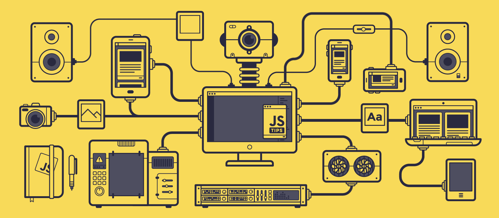

# 0x04. AirBnB clone - Web framework

A webframeworks is a software framework that is designed to support the development of web applications including web services, web resources and web APIs

In this project, we are going to learn and experiment using the Flask WebFrameworks.

Flask is a lightweight WSGI web application framework. It is designed to make getting started quick and easy, with the ability to scale up to complex applications. It began as a simple wrapper around Werkzeug and Jinja and has become one of the most popular Python web application frameworks.

# Resources

Read or watch:

- [What is a Web Framework?](https://intelegain-technologies.medium.com/what-are-web-frameworks-and-why-you-need-them-c4e8806bd0fb)
- [A Minimal Application](https://flask.palletsprojects.com/en/2.3.x/quickstart/#a-minimal-application)
- [Routing (except “HTTP Methods”)](https://flask.palletsprojects.com/en/2.3.x/quickstart/#routing)
- [Rendering Templates](https://flask.palletsprojects.com/en/2.3.x/quickstart/#rendering-templates)
- [Synopsis](https://jinja.palletsprojects.com/en/2.9.x/templates/#synopsis)
- [Variables](https://jinja.palletsprojects.com/en/2.9.x/templates/#variables)
- [Comments](https://jinja.palletsprojects.com/en/2.9.x/templates/#comments)
- [Whitespace Control](https://jinja.palletsprojects.com/en/2.9.x/templates/#whitespace-control)
- [List of Control Structures (read up to “Call”)](https://jinja.palletsprojects.com/en/2.9.x/templates/#list-of-control-structures)
- [Flask](https://palletsprojects.com/p/flask/)
- [Jinja](https://jinja.palletsprojects.com/en/2.9.x/templates/)
